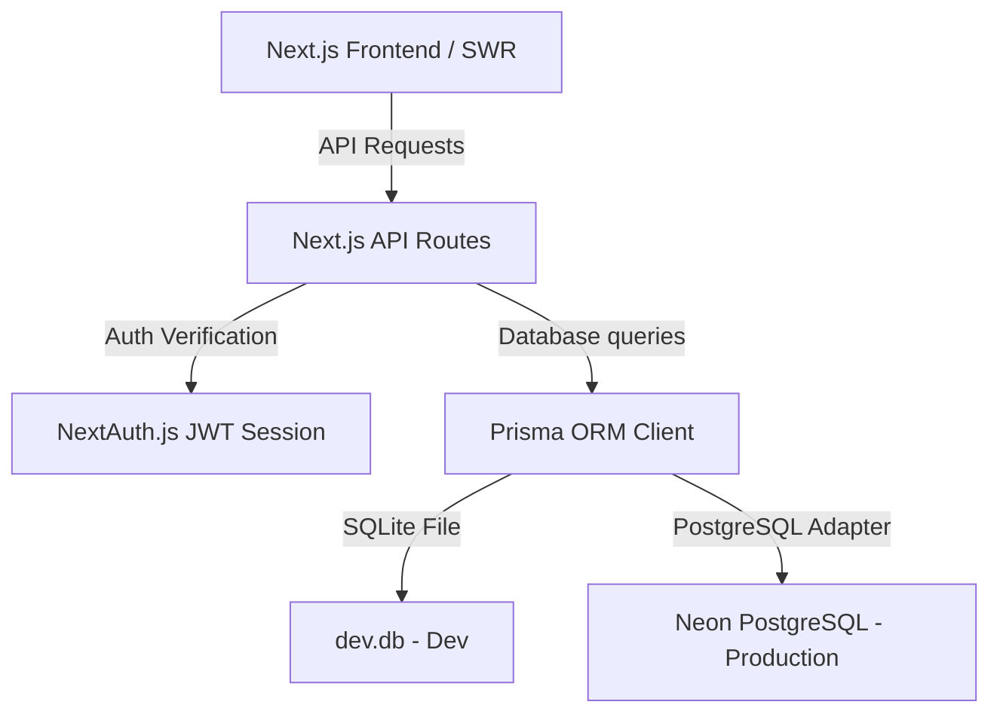

# EduSphere - College Discovery & Comparison Platform

EduSphere is a premium, full-stack college search, filter, and comparison platform designed for students exploring educational institutions. It features high-end visual aesthetics, reactive dashboards, real-time comparisons, interactive reviews, and protected bookmark managers.

---

## Tech Stack
* **Frontend**: Next.js 14 (App Router), React, TypeScript, Tailwind CSS
* **Backend**: Next.js API Routes, Node.js, TypeScript
* **Database**: SQLite (Local Dev) / PostgreSQL (Production ready) with Prisma ORM
* **Authentication**: NextAuth.js (JWT Strategy with custom Credentials provider)
* **State Management**: SWR (Stale-While-Revalidate) for fluid, optimistic caching

---

## Key Features

1. **College Search & Advanced Filters**
   * Instant debounced search (300ms delay) on college names.
   * Multi-dimensional filtering by location, fees ranges, and ratings.
   * Reactively updates results without page reload.
   * Paginated results (10 colleges per page) with lazy loading for images and skeleton loaders.

2. **Interactive College Detail Pages (`/colleges/[id]`)
   * Immersive header with location, establishment year, rating, and description.
   * Placement metrics rendered with customized salary range charts and top recruiter lists.
   * Dynamic Course Fees table listing program names and fees.
   * Dynamic reviews thread: Logged-in users can write comments and select 1–5 stars to instantly update the college rating.

3. **Comparison Engine (`/compare`)**
   * Side-by-side comparison tables evaluating Location, Fees, Placements (Average and Highest salaries), Recruiters, and Course structures.
   * Autocomplete addition control to search and add colleges (up to 3) on the fly.
   * URL parameter integration (`?ids=id1,id2`) allowing easy comparison sharing.
   * "Save This Comparison" options to save the set.

4. **Saved Dashboards & Protected Routes (`/saved`)**
   * Bookmarked Colleges tab to view all saved colleges (toggled with heart icons).
   * Saved Comparisons tab to manage saved comparison sets.
   * Protected routing: Unauthenticated users are redirected to login.

---

## Local Setup & Installation

Follow these steps to run the application locally on your machine:

### 1. Clone and Install Dependencies
```bash
git clone <repository-url>
cd college-discovery
npm install
```

### 2. Configure Environment Variables
Create a `.env` file in the root directory (based on `.env.example`):
```env
# Local SQLite Setup (Default)
DATABASE_URL="file:./dev.db"

# NextAuth Configuration
NEXTAUTH_SECRET="f90656a8fbda69bfdeecb7bc782976fba8340dcd51197475d40a28f87eeea11c"
NEXTAUTH_URL="http://localhost:3000"
```

### 3. Generate Prisma Clients and Seed Database
Sync the database schemas with your local SQLite database and populate it with 20 realistic Indian colleges:
```bash
# Push schema to create local SQLite file dev.db
npx prisma db push

# Seed 20 premium Indian colleges, placements, and reviews
npx prisma db seed
```

### 4. Run Development Server
```bash
npm run dev
```
Open [http://localhost:3000](http://localhost:3000) in your browser to view the platform.

---

## Architecture Design



### Key Modules:
* **`prisma/schema.prisma`**: Single-source of schema data structures, using a SQLite-to-PostgreSQL compatible mapping (storing recruiter arrays as comma-separated lists to allow SQLite serverless testing).
* **`lib/auth.ts`**: Implements password hashing with `bcryptjs` and session tokens containing the user's ID for secure database lookups.
* **`components/`**: Clean, modular UI units. Auto-debouncing SearchBar, reactive heart SaveButton, and self-cleaning SWR wrappers prevent interface lags.

---

## API Routes Documentation

All API responses follow the uniform schema structure:
```json
{
  "success": true,
  "data": {},
  "message": "Status description"
}
```

### 1. Authentication
* `POST /api/auth/signup`
  * Body: `{ name, email, password }`
  * Registers a new student account. Password must be at least 6 characters.
* `POST /api/auth/[...nextauth]`
  * Manages login session bindings.

### 2. College Search & Details
* `GET /api/colleges`
  * Query parameters: `search`, `location`, `rating`, `feesMin`, `feesMax`, `page`
  * Fetches colleges based on query filters.
* `GET /api/colleges/[id]`
  * Retrieves detailed overview, placement charts, courses list, and reviews.
* `POST /api/colleges/[id]`
  * Body: `{ rating, comment }` *(Requires Session)*
  * Creates a new star review and updates the college average rating.
* `POST /api/colleges/compare`
  * Body: `{ collegeIds: ["id1", "id2"] }`
  * Returns detailed side-by-side spec arrays.

### 3. Bookmarks & Comparisons (Session Required)
* `GET /api/saved` - Fetches all saved colleges.
* `POST /api/saved` - Body: `{ collegeId }` - Saves a college.
* `DELETE /api/saved/[id]` - Removes a saved college.
* `GET /api/saved/comparisons` - Fetches all saved comparisons.
* `POST /api/saved/comparisons` - Body: `{ collegeIds: ["id1", "id2"] }` - Saves a comparison set.
* `DELETE /api/saved/comparisons/[id]` - Deletes a comparison set.

---

## Production Deployment Guide (Vercel + Neon)

### 1. Set Up PostgreSQL on Neon
1. Go to [Neon.tech](https://neon.tech) and create a free PostgreSQL project.
2. Retrieve your **Connection String** (`postgres://...`).
3. Set your production database provider back to PostgreSQL in `prisma/schema.prisma` if desired:
   ```prisma
   datasource db {
     provider = "postgresql"
     url      = env("DATABASE_URL")
   }
   ```
   *(Note: The comma-separated recruiters list remains fully compatible).*

### 2. Deploy to Vercel
1. Push your project code to GitHub.
2. Link your GitHub repository in the Vercel dashboard.
3. Configure the following **Environment Variables** in Vercel project settings:
   * `DATABASE_URL`: Your Neon connection string.
   * `NEXTAUTH_SECRET`: A secure random password.
   * `NEXTAUTH_URL`: Your Vercel deployment URL (e.g. `https://your-app.vercel.app`).
4. Add the following build command in Vercel dashboard project settings:
   * Build Command: `npx prisma generate && next build`
5. Deploy the project. Run your seeding script via Prisma Console or a temporary deploy endpoint.
